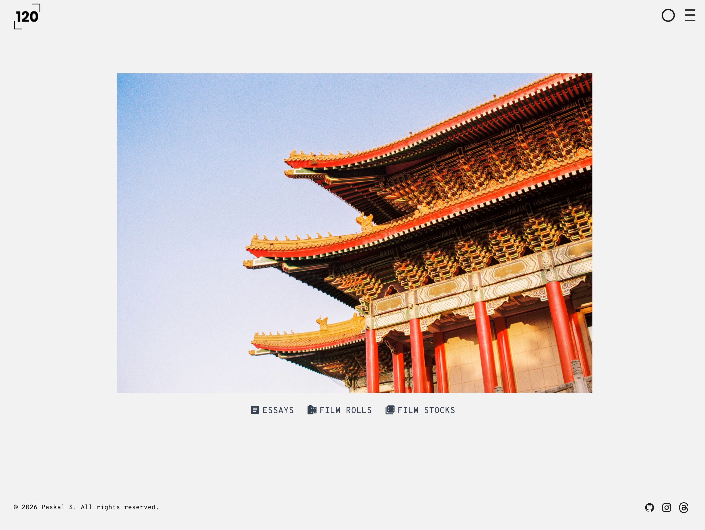
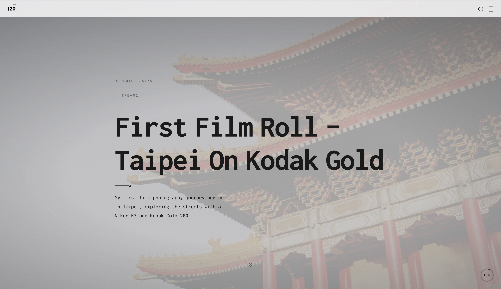
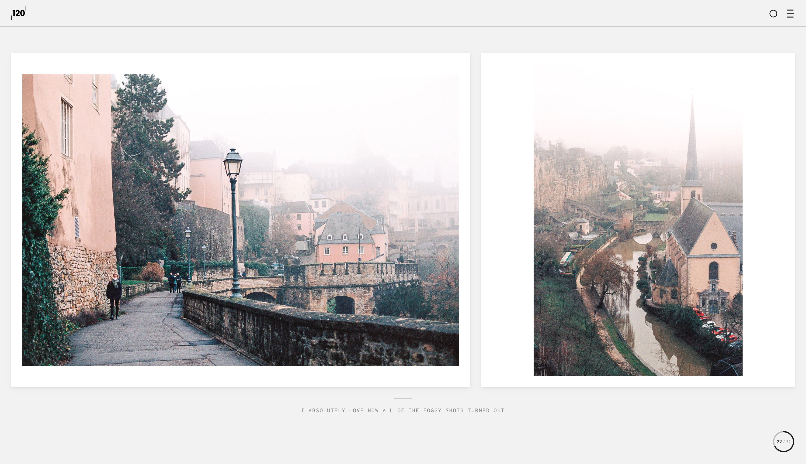
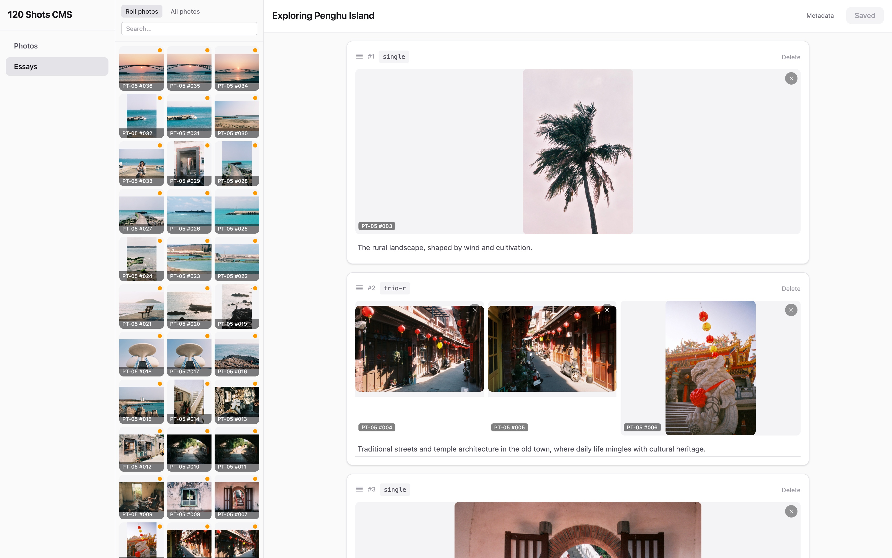

# 120 Shots

> Film photography portfolio with visual essay editor






Based on [revista-3](https://github.com/erfianugrah/revista-3) | Live at [120shots.com](https://120shots.com)

## Overview

A photography portfolio built with [Astro](https://astro.build), designed around film photography. Content lives as YAML files in the repo, photos are hosted on [CloudFlare R2](https://developers.cloudflare.com/r2/), and the site deploys as a static build to [CloudFlare Pages](https://pages.cloudflare.com).

The project includes a local visual CMS for composing and editing photo essays with drag-and-drop spread layouts.

## Getting Started

### 1. Install

```sh
yarn install
```

### 2. Environment

Create a `.env` file in the root directory:

```env
R2_ACCOUNT_ID=your account ID
R2_ACCESS_KEY_ID=your access key
R2_SECRET_ACCESS_KEY=your secret access key
BUCKET_NAME=name of your bucket
BUCKET_PUBLIC_URL=public URL of your bucket
TOP_LEVEL_DIR=images/
GOOGLE_API_KEY=your google cloud api key  # Optional: for Vision API image descriptions
```

### 3. Development

```sh
yarn dev       # Astro dev server
yarn cms       # Photo essay CMS at localhost:4444
yarn build     # Production build
yarn postbuild # Generate search index (Pagefind)
yarn preview   # Preview production build
yarn lint      # Format with Prettier
```

The Pagefind search only works after a full build (`yarn build && yarn postbuild`).

## Content Workflow

The recommended workflow for publishing new content:

### Step 1: Create a film roll (scripts or Claude)

Film rolls are created from a folder of photos using CLI scripts. The script processes images, uploads them to R2, and generates a YAML file with metadata.

```sh
yarn create-roll -p /path/to/photos -n ROLL-NAME -f film-stock -c "Camera Name"
```

This uses Google Vision API by default to generate alt text descriptions (requires `GOOGLE_API_KEY`). Use `--skipVision` to skip this.

### Step 2: Create a draft essay (scripts, Claude, or CMS)

There are three ways to create essays:

**From existing rolls** (recommended for a quick start):

```sh
yarn create-roll-essay -r "ROLL-NAME1,ROLL-NAME2" -t "Essay Title"
```

**From a folder of photos** (uploads + creates essay in one step):

```sh
yarn create-essay -p /path/to/photos -d upload-dir -t "Essay Title"
```

**From the CMS** (select photos visually):

Open `yarn cms`, go to Essays, click "New Essay", select photos from any roll, and click Create.

### Step 3: Refine in the CMS

```sh
yarn cms
```

The CMS ([localhost:4444](http://localhost:4444)) provides a visual editor for arranging essays:

- Drag photos from the sidebar into spread slots
- Choose from 8 spread layouts (single, duo, trio, and emphasized variants)
- Reorder spreads with drag handles
- Move or swap photos between slots
- Edit captions, metadata, cover photo, and tags
- Save writes directly to the YAML files with Ctrl/Cmd+S

See [cms/README.md](cms/README.md) for full CMS documentation.

### Interactive Claude command

For a guided experience through any of the above workflows, use the `/photo` Claude Code slash command:

```sh
/photo          # Interactive menu
/photo roll     # Create a film roll
/photo essay    # Create an essay from photos
/photo rollessay # Create an essay from existing rolls
```

## Content Types

All content is defined as [Astro content collections](https://docs.astro.build/en/guides/content-collections/) with Zod schemas in `src/content/config.ts`.

### Photo Essays (`src/content/photoessays/`)

YAML files defining visual stories with photo spreads. Each spread has a layout type and one or more photos.

**Spread layouts:**

| Layout | Photos | Description |
|--------|--------|-------------|
| `single` | 1 | One photo, full width |
| `duo` | 2 | Two photos side by side |
| `duo-l` | 2 | Left photo emphasized (wider) |
| `duo-r` | 2 | Right photo emphasized (wider) |
| `trio` | 3 | Three photos in a row |
| `trio-l` | 3 | Left photo large, two stacked right |
| `trio-r` | 3 | Two stacked left, right photo large |

Essays support full-viewport scroll-snap navigation, optional captions per spread, keyboard controls, and mobile-responsive vertical stacking.

<details>
<summary>Example essay YAML</summary>

```yaml
title: "Taipei Streets"
description: "Wandering through the urban layers of Taiwan's capital"
pubDate: 2024-01-20
author: paskal
rolls:
  - 2021/TPE-01
filmStocks:
  - gold-200
tags:
  - street
  - taiwan

spreads:
  - layout: single
    photos:
      - src: https://cdn.120shots.com/images/TPE-01/photo-001.webp
        alt: Taipei skyline
    caption: "Looking up at Taipei 101"

  - layout: duo
    photos:
      - src: https://cdn.120shots.com/images/TPE-01/photo-002.webp
        alt: Street scene
      - src: https://cdn.120shots.com/images/TPE-01/photo-003.webp
        alt: Night market
    caption: "Day and night"

  - layout: trio
    photos:
      - src: https://cdn.120shots.com/images/TPE-01/photo-004.webp
        alt: Temple
      - src: https://cdn.120shots.com/images/TPE-01/photo-005.webp
        alt: Incense
      - src: https://cdn.120shots.com/images/TPE-01/photo-006.webp
        alt: Lanterns
```

</details>

### Film Rolls (`src/content/rolls/`)

YAML files organized by year (e.g., `rolls/2024/TPE-01.yaml`). Each roll contains shot sequences with image URLs, dates from EXIF data, and optional labels/location metadata.

### Film Stocks (`src/content/films/`)

YAML files describing film stocks (brand, ISO, color type). Referenced by rolls.

### Authors (`src/content/authors/`)

MDX files with author profiles.

## Script Reference

### `yarn create-roll` — Create a film roll

```sh
yarn create-roll -p /dir/with/photos -n ROLL-NAME -f film-stock -c "Camera" -rs
```

| Flag | Description |
|------|-------------|
| `-p` | Photos source directory |
| `-n` | Roll name (also used as R2 subdirectory) |
| `-f` | Film stock ID (must match `src/content/films/`) |
| `-c` | Camera used |
| `-m` | Max image dimension in px (default: 2000) |
| `-r` | Rename files with roll name prefix + sequence number |
| `-s` | Add random suffix to filenames |
| `--skipVision` | Skip Google Vision API alt text generation |

Reads EXIF dates from photos. Requires R2 credentials in `.env`.

### `yarn create-essay` — Create an essay from photos

```sh
yarn create-essay -p /dir/with/photos -d upload-dir -t "Title" -m 2000
```

| Flag | Description |
|------|-------------|
| `-p` | Photos source directory |
| `-d` | R2 upload subdirectory |
| `-t` | Essay title |
| `-m` | Max image dimension in px (default: 2000) |
| `-r` | Rename files with prefix + sequence number |
| `-s` | Add random suffix to filenames |

### `yarn create-roll-essay` — Create an essay from existing rolls

```sh
yarn create-roll-essay -r "ROLL1,ROLL2" -t "Title"
```

| Flag | Description |
|------|-------------|
| `-r` | Comma-separated roll IDs |
| `-t` | Essay title |

### `yarn describe-images` — Generate image descriptions

```sh
yarn describe-images "https://cdn.120shots.com/images/roll/photo.webp"
```

Uses Google Vision API. Options: `--detailLevel` (basic/detailed/comprehensive), `--delay` (ms between API calls).

### `yarn r2-stats` — R2 bucket statistics

```sh
yarn r2-stats --detailed
```

Options: `--detailed`, `--prefix`, `--json`, `--limit`.

### `yarn reformat` — Reformat YAML content files

```sh
yarn reformat -f path/to/file.yaml
```

Reformats roll or essay YAML with consistent formatting. Creates `.bak` backup by default (`--noBackup` to skip).

## Deployment

Build and deploy as a static site on [CloudFlare Pages](https://developers.cloudflare.com/pages/framework-guides/deploy-an-astro-site/):

```sh
yarn build && yarn postbuild
```

## Using as a Template

```sh
npm create astro@latest -- --template paskals/120shots-website
```

After creating your site:

1. Delete example content from `src/content/photoessays/`, `src/content/rolls/`, and `src/content/authors/`
2. Create your own author profile under `src/content/authors/`
3. Set your site URL in `astro.config.mjs`
4. Update metadata and favicon in `src/layouts/BaseLayout.astro`
5. Create a CloudFlare R2 bucket and add credentials to `.env`

## Architecture

- [Components](src/Components-README.md)
- [Layouts](src/Layouts-README.md)
- [Pages](src/Pages-README.md)
- [Content](src/Content-README.md)
- [CMS](cms/README.md)
